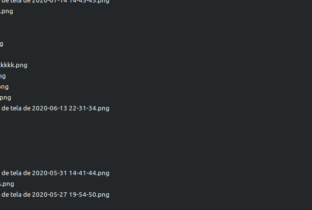

# Redimensionador
  Projeto feito em python utilizando agora QTdisigner.
  Esse projeto é parte de um curso que estou fazendo, basicamente a aplicação carrega uma imagem e a redimencia, com base na largura
  fornessida pelo usuario assim realizando o calculo da altura.
  
   
