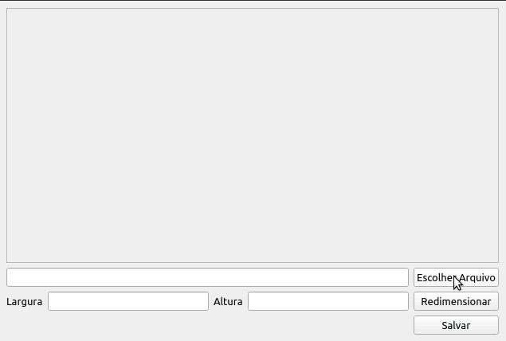

# Redimensionador
  Projeto feito em python utilizando agora QT designer.
  Esse projeto é parte de um curso que estou fazendo, basicamente a aplicação carrega uma imagem e a redimensiona, com base na largura
  fornecida pelo usuario assim realizando o calculo da altura da imagem.
  
   
